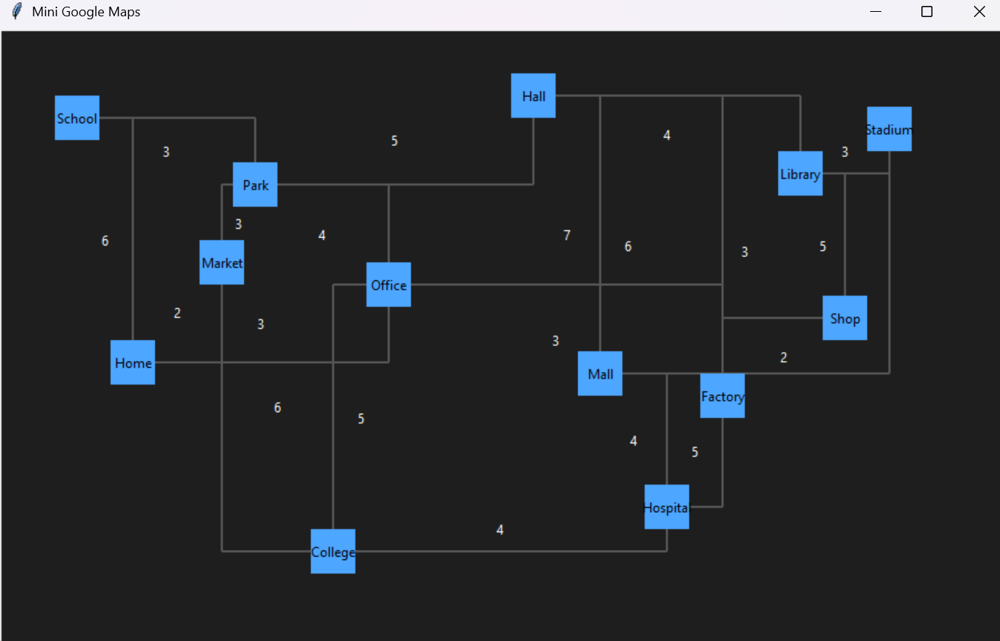
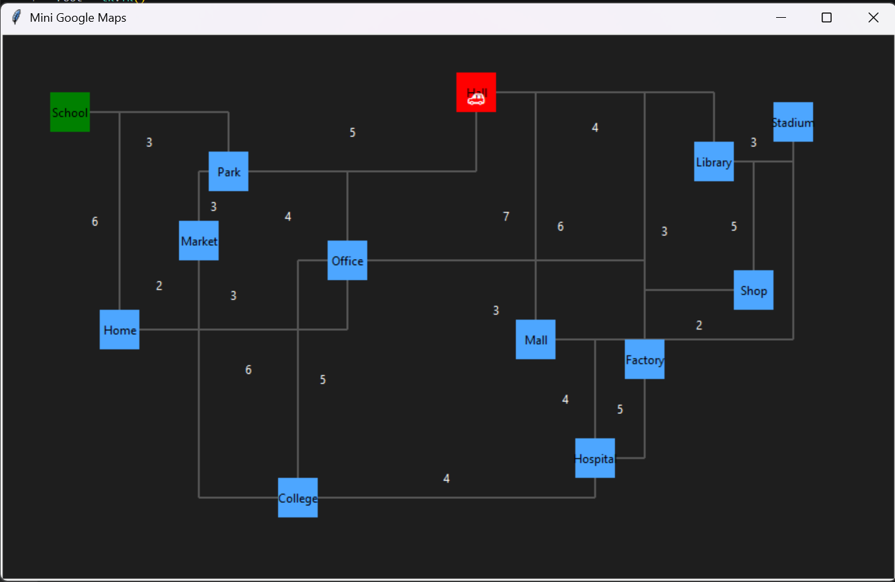
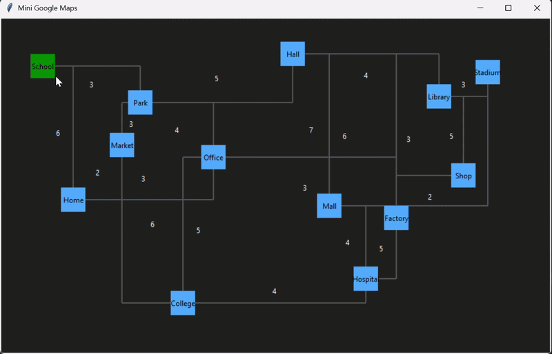

<h1 align="center">
  🗺️ Simple Map Model & Pathfinding Visualizer
</h1>

<p align="center">
  
</p>

<p align="center">
  
  
  
  
  
</p>

---

## 🚀 About the Project

A simple **map simulation and pathfinding visualizer** built using Python.
This project demonstrates how **graph-based maps** work and how the **shortest path** between two points is calculated and visualized.

Users can click on nodes to select a start and end point, and watch a 🚗 move along the computed shortest path.

---

## 📸 Screenshots

### 🗺️ Map Layout

<p align="center">
  
</p>

### 📍 Node Selection

<p align="center">
  
</p>

### 🚗 Path Animation

<p align="center">
  
</p>

---

## ✨ Features

* 🗺️ Graph-based map model
* 🧠 Shortest path using Dijkstra’s Algorithm
* 🖱️ Click to select start & end nodes
* 🚗 Smooth animated movement
* 📏 Weighted edges (distance-based)
* 🔄 Reset and re-run simulation
* 🎨 Minimal dark UI

---

## 🛠️ Tech Stack

| Technology      | Purpose        |
| --------------- | -------------- |
| Python 🐍       | Core logic     |
| Tkinter 🎨      | GUI            |
| Heapq ⚡         | Priority Queue |
| Graph Theory 🧠 | Pathfinding    |

---

## 📁 Project Structure

<p align="center">
  
</p>

```bash
project/
│── main.py            # UI & animation
│── graph_data.py      # Map nodes & graph
│── dijkstra.py        # Pathfinding algorithm
│── assets/            # Images
│── README.md
```

---

## 🧠 Workflow

<p align="center">
  
</p>

### Steps:

1. Select start node 🟢
2. Select end node 🔴
3. Algorithm computes shortest path
4. Path converted into coordinates
5. 🚗 Animation follows the path

---

## 🎬 Animation Logic

```python
y = y1 + (y2 - y1) * t / steps
```

* Uses **Linear Interpolation (LERP)**
* Ensures smooth movement between nodes

---

## ▶️ Run Locally

```bash
python main.py
```

---

## 📦 Build Executable

```bash
python -m PyInstaller --onefile --windowed main.py
```

Output:

```
dist/main.exe
```

---

## 🌟 Future Improvements

* 🚀 Add A* algorithm
* 🎯 Highlight shortest path visually
* 📍 Add dynamic node creation
* 🎮 Interactive drag-and-drop nodes
* 🌐 Web version (React / Flask)

---

## 🧠 Learning Outcomes

* Understanding graph-based models
* Implementing Dijkstra’s Algorithm
* Event-driven programming
* Animation using interpolation

---

## 👨‍💻 Author

**Sarvesh**
Student Developer 🚀

---

## ⭐ Support

If you like this project:

⭐ Star the repository
🍴 Fork and improve
📢 Share with others

---
